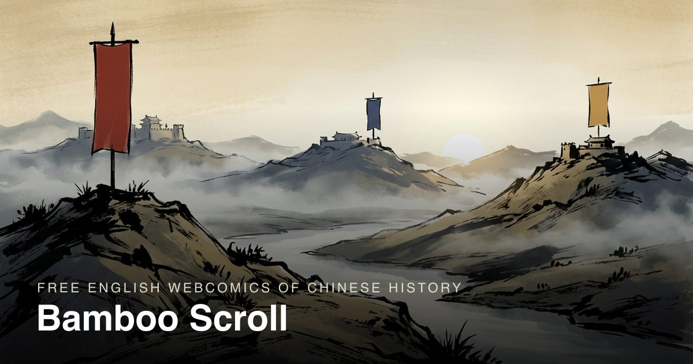
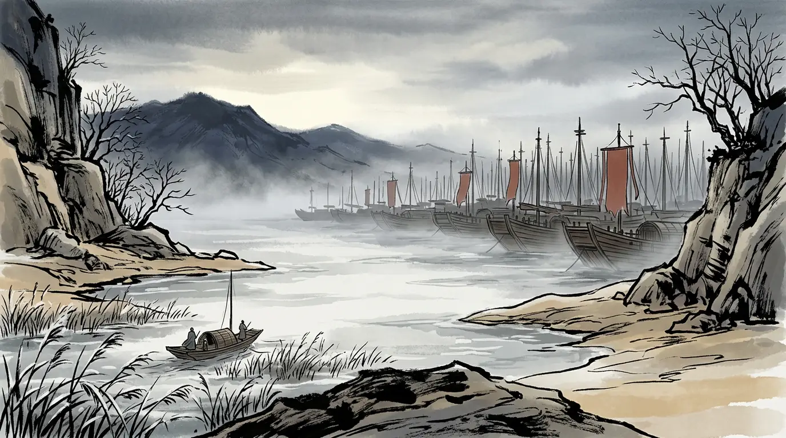
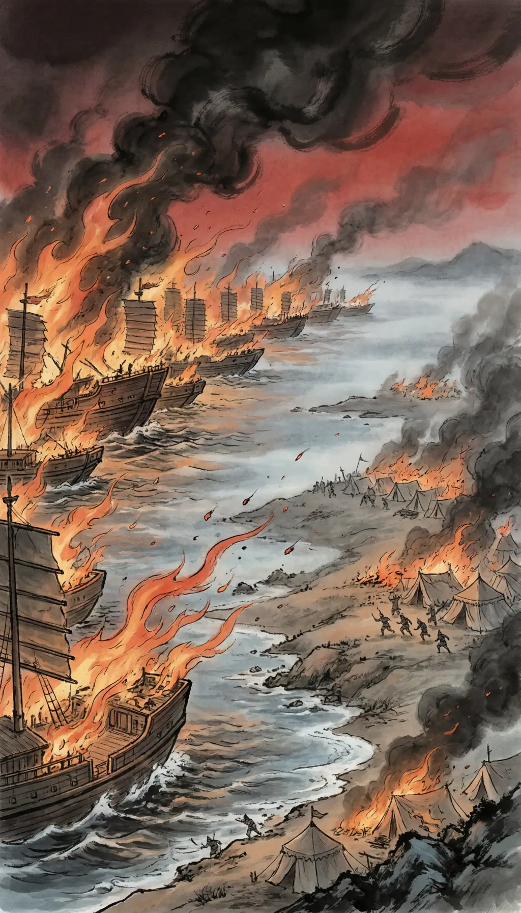

# Bamboo Scroll

### Chinese history in comics — told from the sources, not from the novel.

[Read Bamboo Scroll](https://dreamofxm.github.io/bambooscroll/) · [Start with the Three Kingdoms](https://dreamofxm.github.io/bambooscroll/dynasty/three-kingdoms/) · [Browse the people](https://dreamofxm.github.io/bambooscroll/people/)



<p align="center">
  
  
  
</p>

<p align="center"><em>Read the illustrated story of Red Cliff, then explore the people and sources behind it.</em></p>

Bamboo Scroll is a free English webcomic about Chinese history. It uses short, illustrated episodes to make the past approachable, while keeping every claim connected to a historical source.

The first complete season follows the **Three Kingdoms**, from the late Han crisis to the fall of Wu in 280 CE. Earlier Han episodes are also available, with more periods planned.

## Start reading

- [Three Kingdoms: 12 episodes](https://dreamofxm.github.io/bambooscroll/dynasty/three-kingdoms/)
- [Episode 1 — Fire on the Yangtze](https://dreamofxm.github.io/bambooscroll/read/three-kingdoms/01/)
- [The Han: 13 episodes](https://dreamofxm.github.io/bambooscroll/dynasty/han/)
- [People and biographies](https://dreamofxm.github.io/bambooscroll/people/)
- [Glossary of names and terms](https://dreamofxm.github.io/bambooscroll/glossary/)
- [Sources and method](https://dreamofxm.github.io/bambooscroll/method/)

## What makes it different

### A comic first

Each episode is a short visual story designed for readers who may know the famous names but not the historical context.

### Sources on the page

Captions, quotations and historical notes identify the relevant records, including the *Records of the Three Kingdoms*, *Book of the Later Han*, Pei Songzhi's commentary and the *Zizhi Tongjian*.

### Myth Checks

The *Romance of the Three Kingdoms* is an important work of literature, but it is not used as evidence. Famous scenes that differ from the historical record are placed in separate Myth Checks.

### Honest uncertainty

When dates, locations, numbers or motives are disputed, the page marks them as debated instead of presenting one answer as certain.

### Free and classroom-friendly

The site is free to read, requires no account and is designed to be useful to curious readers, students and teachers.

## The Three Kingdoms season

| Episode | Historical setting |
| --- | --- |
| [Fire on the Yangtze](https://dreamofxm.github.io/bambooscroll/read/three-kingdoms/01/) | Red Cliff, 208 CE |
| [The Road to Guandu](https://dreamofxm.github.io/bambooscroll/read/three-kingdoms/02/) | Guandu, 200 CE |
| [Fire at Yiling](https://dreamofxm.github.io/bambooscroll/read/three-kingdoms/03/) | Yiling, 222 CE |
| [The Last Campaign](https://dreamofxm.github.io/bambooscroll/read/three-kingdoms/04/) | Wuzhang Plains, 234 CE |
| [The Pass and the River](https://dreamofxm.github.io/bambooscroll/read/three-kingdoms/05/) | Tong Pass, 211 CE |
| [The City and the Ford](https://dreamofxm.github.io/bambooscroll/read/three-kingdoms/06/) | Hefei, 215 CE |
| [The Heights Above the River](https://dreamofxm.github.io/bambooscroll/read/three-kingdoms/07/) | Hanzhong, 217–219 CE |
| [High Water](https://dreamofxm.github.io/bambooscroll/read/three-kingdoms/08/) | Fancheng, 219 CE |
| [The Bait at Shiting](https://dreamofxm.github.io/bambooscroll/read/three-kingdoms/09/) | Shiting, 228 CE |
| [The Gates at Dawn](https://dreamofxm.github.io/bambooscroll/read/three-kingdoms/10/) | Luoyang, 249 CE |
| [The Gate and the Trackless Road](https://dreamofxm.github.io/bambooscroll/read/three-kingdoms/11/) | Chengdu, 263 CE |
| [The Fall of Wu](https://dreamofxm.github.io/bambooscroll/read/three-kingdoms/12/) | The Yangtze, 280 CE |

## How it is built

Bamboo Scroll is a static site designed to be fast, readable and easy for search engines to index.

- Plain HTML, CSS and JavaScript
- No framework or runtime data fetch
- Episodes stored as content data and prerendered to HTML
- Responsive WebP and AVIF artwork
- Generated `robots.txt` and `sitemap.xml`
- Hosted on GitHub Pages

```bash
npm install
npm run build
npm run serve
```

The local preview runs at `http://127.0.0.1:8901`.

## Research and artwork

Research, scripts, sourcing and editing are human-led. Artwork is generated from original character models under Bamboo Scroll's art direction. No artwork is taken from another creator, studio or game.

A correction is welcome when a date, name, place, number or translation does not match the cited source. Please open an issue or use the contact address on the site.

## Use in education

Teachers and students may print, share and translate the comics for non-commercial classroom use with credit. For other reuse, including commercial reuse, please contact us first.

## License

There is currently no general open-source license for the site's content. The educational permission above is the project's deliberate exception; all other reuse requires permission.
